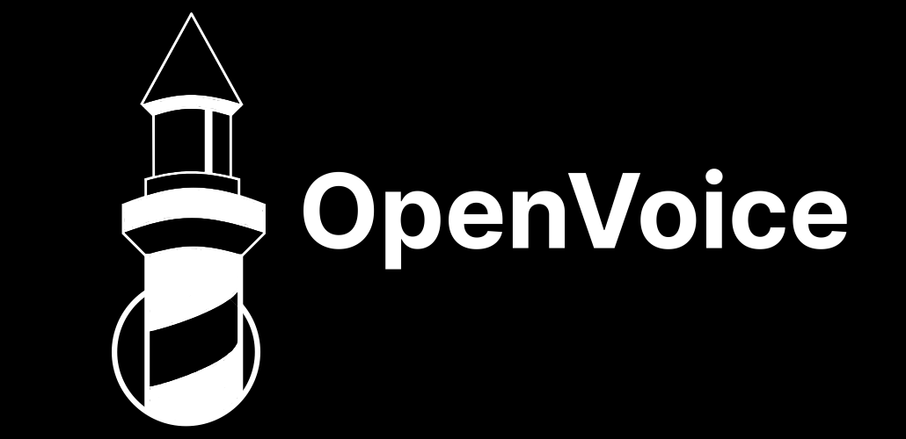

  

# OpenVoice

O OpenVoice é uma rede social desenvolvida com o foco em priorizar a segurança dos dados e a privacidade dos usuários. 

Diferente das redes sociais tradicionais, OpenVoice coleta o mínimo de dados pessoais, não utiliza algoritmos para manipular o conteúdo que você vê e não exibe anúncios. 

A missão desse projeto é oferecer uma plataforma que respeite a liberdade de expressão e colca o controle da privacidade nas mãos dos usuários.

## Créditos

| Autor | Descrição |
| :---: | :--- |
|  | **Prova de Conceito (POC) por [Felipe Pereira](https://github.com/VerbalThree)** |
|  | **[Gustavo Marinho](https://avatars.githubusercontent.com/u/169792459?v=4)** |
|  | **Ismael Avelino** |
|  | **Laryssa Torres** |
|  | **Maria Eduarda** |
|  | **Gustavo Silva** |

## Licença

[MIT License]("/LICENSE")

