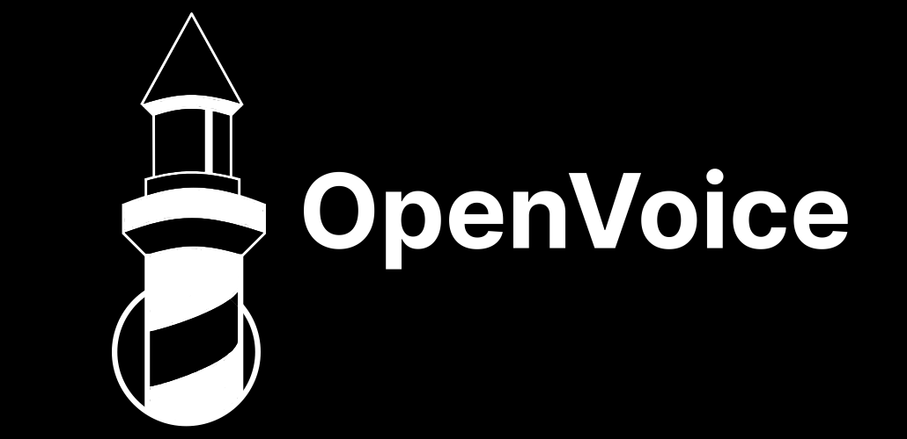

  

  
  
  

# OpenVoice

O OpenVoice é uma rede social desenvolvida com o foco em priorizar a segurança dos dados e a privacidade dos usuários. 

Diferente das redes sociais tradicionais, OpenVoice coleta o mínimo de dados pessoais, não utiliza algoritmos para manipular o conteúdo que você vê e não exibe anúncios. 

A missão desse projeto é oferecer uma plataforma que respeite a liberdade de expressão e colca o controle da privacidade nas mãos dos usuários.

## Documentação

Explore os princípios que fundamentam a criação desta plataforma.

**[Documentação em PDF](misc/media/Documentação_OpenVoice.pdf)**

## Tecnologias Utilizadas

O OpenVoice foi criado utilizando as seguintes tecnologias:

- **[HTML](https://developer.mozilla.org/en-US/docs/Web/HTML), [CSS](https://developer.mozilla.org/en-US/docs/Web/CSS) & [JavaScript](https://developer.mozilla.org/en-US/docs/Web/JavaScript)**: Para a estruturação, estilização, design responsivo e interatividade com funcionalidades dinâmicas.
- **[Bootstrap](https://getbootstrap.com/)**: Framework CSS para criação de layouts e componentes responsivos.
- **[Vue.js](https://vuejs.org/)**: Framework progressivo para construção de interfaces de usuário.
- **[Vue Router](https://router.vuejs.org/)**: Gerenciamento de rotas para navegação no front-end, possibilitando que o projeto seja uma [Single-page Application](https://developer.mozilla.org/en-US/docs/Glossary/SPA).
- **[Vue I18n](https://vue-i18n.intlify.dev/)**: Para suporte a internacionalização e tradução.
- **[Laravel](https://laravel.com/)**: Framework PHP para o desenvolvimento do Back-end.
- **[WebSocket](https://developer.mozilla.org/en-US/docs/Web/API/WebSockets_API)**: Para comunicação em tempo real entre o cliente e o servidor.
- **[MySQL](https://www.mysql.com/)**: Sistema de gerenciamento de banco de dados relacional utilizado para armazenamento de dados.
  
## Versão

Atualmente, o OpenVoice está na versão <code>1.0.0</code>.

## Autores

| Autor | Descrição |
| :---: | :--- |
|  | **Prova de Conceito (POC) por [Felipe Pereira](https://github.com/VerbalThree)** |
|  | **[Gustavo Marinho](https://github.com/GusttaviCute)** |
|  | **Ismael Avelino** |
|  | **Laryssa Torres** |
|  | **Maria Eduarda** |
|  | **Gustavo Silva** |

## Licença

O OpenVoice é licenciado sob a **[Licença MIT](LICENSE)**.
